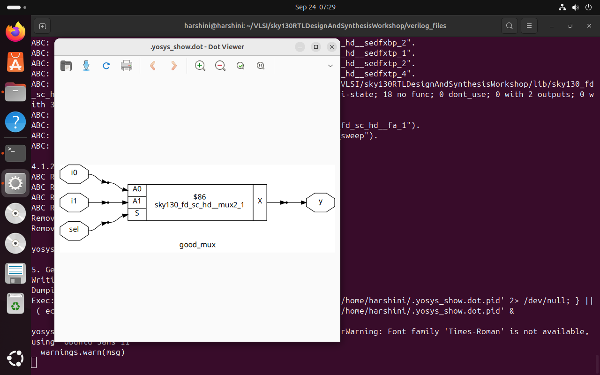

# Week 1 - Day 1

## 0. Setup

Before starting with simulation and synthesis, I created a separate folder named **`VLSI`** to store all necessary libraries and reference Verilog codes.  

Then, I cloned the following GitHub repository which contains the Sky130 libraries and design files:  

```bash
git clone https://github.com/kunalg123/sky130RTLDesignAndSynthesisWorkshop

---

````markdown
# Week 1 - Day 1

## 1. Tools Used

### 🔹 Icarus Verilog (iverilog)
- Open-source Verilog simulator.
- Used to compile and simulate Verilog code.
- Generates a `.vcd` file which stores waveform data for viewing in GTKWave.

### 🔹 GTKWave
- Waveform viewer used to visualize signals from `.vcd` files.
- Helps verify the correctness of the design.

### 🔹 Yosys
- Open-source synthesis tool.
- Converts Verilog RTL code into a gate-level netlist.
- Useful for hardware implementation and FPGA/ASIC design flows.

---

## 2. Verilog Simulation

We used a simple Verilog code (`good_mux.v`) and a testbench (`tb_good_mux.v`) to verify functionality.  

### Commands Used:
```bash
# Compile design and testbench
iverilog good_mux.v tb_good_mux.v

# Run simulation
./a.out

# View waveform in GTKWave
gtkwave tb_good_mux.vcd
````

### Main Module Code (`good_mux.v`):

```verilog
module good_mux (
    input i0, 
    input i1, 
    input sel, 
    output reg y
);
always @(*) begin
    if(sel)
        y <= i1;
    else 
        y <= i0;
end
endmodule
```

### Testbench Code (`tb_good_mux.v`):

```verilog
`timescale 1ns / 1ps
module tb_good_mux;
    // Inputs
    reg i0, i1, sel;
    // Outputs
    wire y;

    // Instantiate the Unit Under Test (UUT)
    good_mux uut (
        .sel(sel),
        .i0(i0),
        .i1(i1),
        .y(y)
    );

    initial begin
        $dumpfile("tb_good_mux.vcd");
        $dumpvars(0, tb_good_mux);
        // Initialize inputs
        sel = 0; i0 = 0; i1 = 0;
        #300 $finish;
    end

    always #75 sel = ~sel;
    always #10 i0 = ~i0;
    always #55 i1 = ~i1;
endmodule
```

### GTKWave Output


---

## 3. Synthesis with Yosys

### Commands Used:

```bash
yosys
read_liberty -lib ../VLSI/sky130RTLDesignAndSynthesisWorkshop/lib/sky130_fd_sc_hd__tt_025C_1v80.lib
read_verilog good_mux.v
synth -top good_mux
abc -liberty ../VLSI/sky130RTLDesignAndSynthesisWorkshop/lib/sky130_fd_sc_hd__tt_025C_1v80.lib
show
write_verilog good_mux_netlist.v
write_verilog -noattr good_mux_netlist.v
```

### Netlist Screenshot


### Synthesized Hardware Output



---


