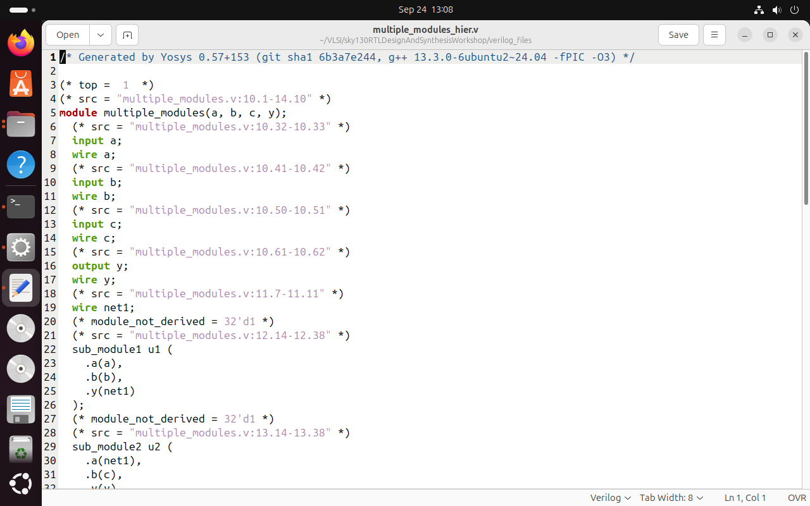

# Week 1 - Day 2

## 📌 Introduction
In Day 2 of the workshop, we explored the role of **cell libraries (`.lib` files)** in synthesis, the difference between **hierarchical vs flat synthesis**, and how to perform **submodule-level synthesis**.  
We also studied **various flip-flop coding styles** (with asynchronous/synchronous resets and sets) and synthesized them using **Yosys**.  
These concepts are fundamental in bridging RTL design with real hardware implementations.

---

## 🎯 Learning Objectives
By the end of Day 2, I learned to:
- Understand the purpose and contents of `.lib` files.  
- Perform **hierarchical vs flat synthesis** and compare their advantages.  
- Apply **submodule-level synthesis** to large designs.  
- Implement and verify **different flip-flop coding styles** in Verilog.  

---

## 1. Library Files (`.lib`)

A `.lib` file is a **cell library file** used during synthesis.  
It contains information about:
- Standard cells and their variations  
- Features such as leakage power, voltage (V), current (I), and delay  

### Command to Open `.lib` File:
```bash
gedit path/to/library.lib
```

  
*The `.lib` file provides power, delay, and functionality details of each standard cell.*

---

## 2. Hierarchical vs Flat Synthesis

| Feature             | Hierarchical Synthesis | Flat Synthesis |
|---------------------|-------------------------|----------------|
| **Structure**       | Preserves module hierarchy | Flattens everything into one |
| **Debugging**       | Easier (clear separation) | Harder (all merged) |
| **Optimization**    | Moderate                | Higher |
| **Reusability**     | High (good for repeated modules) | Low |
| **Preferred Use**   | Large designs with multiple instances | Performance-critical designs |

---

## 3. Hierarchical Synthesis Example

### Commands:
```bash
gedit multiple_modules.v
yosys
read_liberty -lib path/to/library.lib
read_verilog multiple_modules.v
synth -top multiple_modules
abc -liberty path/to/library.lib
show
```

  
*Verilog code for multiple modules.*

  
*Synthesized output showing preserved hierarchy.*

Generate netlist:
```bash
write_verilog multiple_modules_hier.v
!gedit multiple_modules_hier.v
```

  
*Netlist of the hierarchical design.*

---

## 4. Flat Synthesis Example

```bash
read_verilog multiple_modules.v
synth -top multiple_modules
abc -liberty path/to/library.lib
flatten
show
```

  
*Netlist output after flattening the design.*

---

## 5. Submodule Level Synthesis

### Why Use Submodule Synthesis?
- Useful when multiple instances of the same module exist.  
- Saves design effort and improves scalability.  
- Commonly used in large CPU/SoC designs.  

### Commands:
```bash
yosys
read_liberty -lib path/to/library.lib
read_verilog sub_module1.v
abc -liberty path/to/library.lib
show
```

  
*Synthesis at submodule level.*

---

## 6. Various Flip-Flop Coding Styles

### Why Do We Need Flops?
- Pure combinational circuits create glitches.  
- Flip-flops **store values** and provide stable outputs.  
- Without initialization, circuits evaluate garbage → hence we use **set/reset**.  

*Types:*  
- **Asynchronous reset** → reset works anytime, independent of clock.  
- **Synchronous reset** → reset only with clock edge.  

---

### Example 1: D Flip-Flop with Asynchronous Reset

```bash
iverilog dff_asyncres.v tb_dff_asyncres.v
./a.out
gtkwave tb_dff_asyncres.vcd
```

  
*Waveform of DFF with async reset.*

Synthesis:
```bash
yosys
read_liberty -lib path/to/library.lib
read_verilog dff_asyncres.v
synth -top dff_asyncres
dfflibmap -liberty path/to/library.lib
abc -liberty path/to/library.lib
show
```


---

### Example 2: D Flip-Flop with Asynchronous Set

```bash
iverilog dff_async_set.v tb_dff_async_set.v
./a.out
gtkwave tb_dff_async_set.vcd
```

  

Synthesis:
```bash
yosys
read_liberty -lib path/to/library.lib
read_verilog dff_async_set.v
synth -top dff_async_set
dfflibmap -liberty path/to/library.lib
abc -liberty path/to/library.lib
show
```


---

### Example 3: D Flip-Flop with Synchronous Reset

```bash
iverilog dff_syncres.v tb_dff_syncres.v
./a.out
gtkwave tb_dff_syncres.vcd
```

  

Synthesis:
```bash
yosys
read_liberty -lib path/to/library.lib
read_verilog dff_syncres.v
synth -top dff_syncres
dfflibmap -liberty path/to/library.lib
abc -liberty path/to/library.lib
show
```


---

## ✅ Key Takeaways
- `.lib` files contain cell delay, power, and behavior info for synthesis.  
- Hierarchical synthesis preserves module structure; flat synthesis optimizes more.  
- Submodule synthesis improves scalability for repeated module designs.  
- Flip-flops are essential for stable circuits and come in different coding styles.  
- Practical synthesis and simulation steps were executed successfully using **Icarus Verilog, GTKWave, and Yosys**.  

---

