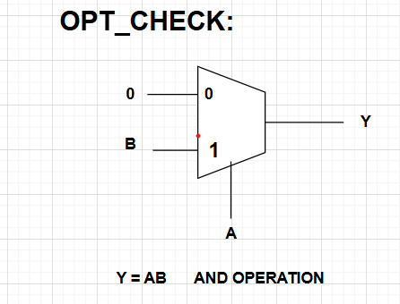
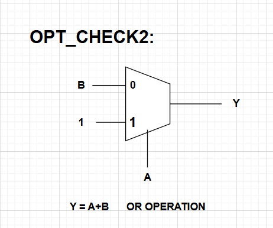
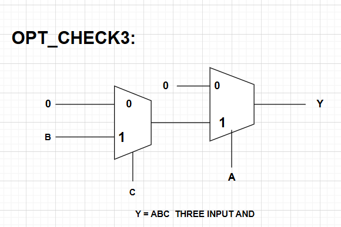
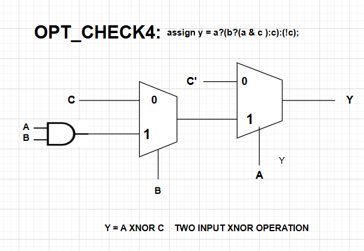

---

# Day 3: Combinational and Sequential Optimization

## 📌 Introduction

In digital design, optimization is crucial for reducing **area, power, and delay** while maintaining correct functionality.  
This day focuses on:

* **Combinational Logic Optimization**
* **Sequential Logic Optimization**

Both are applied during **logic synthesis** using **Yosys** with the Sky130 standard cell library.

---

## 🔹 Combinational Logic Optimization

Combinational optimization tries to **squeeze the logic** for minimal resources.

### ✨ Techniques Used:

* **Constant Propagation** → Direct optimization by replacing constants.
* **Boolean Logic Optimization** → Techniques like K-Map simplification and Quine-McCluskey.

#### Example 1: Constant Propagation

📷 Example Output  


#### Example 2: Boolean Logic Optimization

📷 Example Output  


---

## 🔹 Sequential Logic Optimization

Sequential optimization improves registers and FSM designs.

### Types:

* **Basic** → Sequential constant propagation
* **Advanced** → State optimization, retiming, sequential logic cloning

---

## 🔹 Modules and Results

### 1️⃣ `opt_check.v`

```verilog
module opt_check (input a , input b , output y);
	assign y = a?b:0;
endmodule
````

**Aim:**


**Simulation Commands:**

```bash
iverilog opt_check.v tb_opt_check.v
./a.out
gtkwave tb_opt_check.vcd
```


**Synthesis Commands:**

```tcl
yosys
read_liberty -lib ../VLSI/sky130RTLDesignAndSynthesisWorkshop/lib/sky130_fd_sc_hd__tt_025C_1v80.lib
read_verilog opt_check.v
synth -top opt_check
opt_clean -purge
abc -liberty ../VLSI/sky130RTLDesignAndSynthesisWorkshop/lib/sky130_fd_sc_hd__tt_025C_1v80.lib
show
```

📷 Synthesized Netlist

*Synthesis produced an AND gate*

---

### 2️⃣ `opt_check2.v`

```verilog
module opt_check2 (input a , input b , output y);
	assign y = a?1:b;
endmodule
```

**Aim:**


**Synthesis Commands:**

```tcl
yosys
read_liberty -lib ../VLSI/sky130RTLDesignAndSynthesisWorkshop/lib/sky130_fd_sc_hd__tt_025C_1v80.lib
read_verilog opt_check2.v
synth -top opt_check2
opt_clean -purge
abc -liberty ../VLSI/sky130RTLDesignAndSynthesisWorkshop/lib/sky130_fd_sc_hd__tt_025C_1v80.lib
show
```


*Synthesis produced an OR gate*

---

### 3️⃣ `opt_check3.v`

```verilog
module opt_check3 (input a , input b, input c , output y);
	assign y = a?(c?b:0):0;
endmodule
```

**Aim:**


**Synthesis Commands:**

```tcl
yosys
read_liberty -lib ../VLSI/sky130RTLDesignAndSynthesisWorkshop/lib/sky130_fd_sc_hd__tt_025C_1v80.lib
read_verilog opt_check3.v
synth -top opt_check3
opt_clean -purge
abc -liberty ../VLSI/sky130RTLDesignAndSynthesisWorkshop/lib/sky130_fd_sc_hd__tt_025C_1v80.lib
show
```


*Synthesis produced a three-input AND gate*

---

### 4️⃣ `opt_check4.v`

```verilog
module opt_check4 (input a , input b , input c , output y);
 assign y = a?(b?(a & c ):c):(!c);
endmodule
```

**Aim:**


**Synthesis Commands:**

```tcl
yosys
read_liberty -lib ../VLSI/sky130RTLDesignAndSynthesisWorkshop/lib/sky130_fd_sc_hd__tt_025C_1v80.lib
read_verilog opt_check4.v
synth -top opt_check4
opt_clean -purge
abc -liberty ../VLSI/sky130RTLDesignAndSynthesisWorkshop/lib/sky130_fd_sc_hd__tt_025C_1v80.lib
show
```


*Synthesis produced a two-input XNOR gate*

---

### 5️⃣ `multiple_module_opt1.v`

```verilog
module sub_module1(input a , input b , output y);
 assign y = a & b;
endmodule

module sub_module2(input a , input b , output y);
 assign y = a^b;
endmodule

module multiple_module_opt(input a , input b , input c , input d , output y);
wire n1,n2,n3;
sub_module1 U1 (.a(a) , .b(1'b1) , .y(n1));
sub_module2 U2 (.a(n1), .b(1'b0) , .y(n2));
sub_module2 U3 (.a(b), .b(d) , .y(n3));
assign y = c | (b & n1); 
endmodule
```

📷 Netlist


---

### 6️⃣ `multiple_module_opt2.v`

```verilog
module sub_module(input a , input b , output y);
 assign y = a & b;
endmodule

module multiple_module_opt2(input a , input b , input c , input d , output y);
wire n1,n2,n3;
sub_module U1 (.a(a) , .b(1'b0) , .y(n1));
sub_module U2 (.a(b), .b(c) , .y(n2));
sub_module U3 (.a(n2), .b(d) , .y(n3));
sub_module U4 (.a(n3), .b(n1) , .y(y));
endmodule
```

📷 Netlist


---

## 🔹 Sequential Logic Optimization Examples

### DFF Const 1

```verilog
module dff_const1(input clk, input reset, output reg q);
always @(posedge clk, posedge reset)
begin
	if(reset)
		q <= 1'b0;
	else
		q <= 1'b1;
end
endmodule
```


*It shows the design has 1 flip-flop*

---

### DFF Const 2

```verilog
module dff_const2(input clk, input reset, output reg q);
always @(posedge clk, posedge reset)
begin
	if(reset)
		q <= 1'b1;
	else
		q <= 1'b1;
end
endmodule
```


*No flip-flops needed; Q always 1*


---

### DFF Const 3

```verilog
module dff_const3(input clk, input reset, output reg q);
reg q1;
always @(posedge clk, posedge reset)
begin
	if(reset)
	begin
		q <= 1'b1;
		q1 <= 1'b0;
	end
	else
	begin
		q1 <= 1'b1;
		q <= q1;
	end
end
endmodule
```


---

### DFF Const 4

```verilog
module dff_const4(input clk, input reset, output reg q);
reg q1;
always @(posedge clk, posedge reset)
begin
	if(reset)
	begin
		q <= 1'b1;
		q1 <= 1'b1;
	end
	else
	begin
		q1 <= 1'b1;
		q <= q1;
	end
end
endmodule
```


*Q is always 1*

---

### DFF Const 5

```verilog
module dff_const5(input clk, input reset, output reg q);
reg q1;
always @(posedge clk, posedge reset)
begin
	if(reset)
	begin
		q <= 1'b0;
		q1 <= 1'b0;
	end
	else
	begin
		q1 <= 1'b1;
		q <= q1;
	end
end
endmodule
```


*It has 2 flip-flops*

---

## 🔹 Counter Optimizations

### Counter Opt

```verilog
module counter_opt (input clk , input reset , output q);
reg [2:0] count;
assign q = count[0];

always @(posedge clk ,posedge reset)
begin
	if(reset)
		count <= 3'b000;
	else
		count <= count + 1;
end
endmodule
```

This is a **3-bit up-counter**.


*1 flip-flop used*


---


