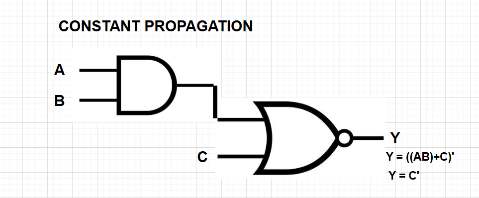
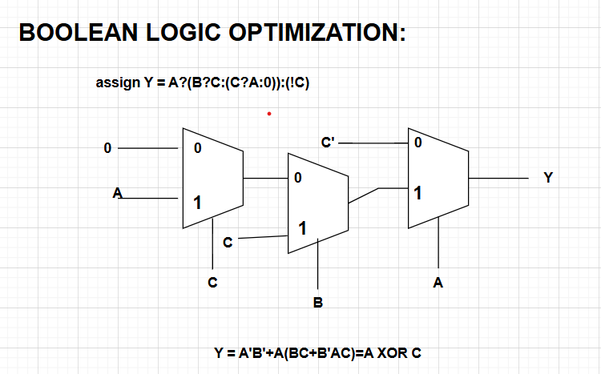
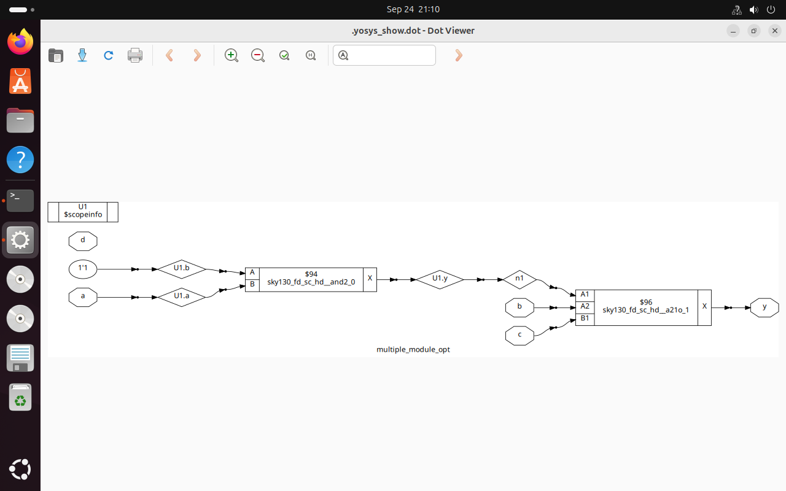
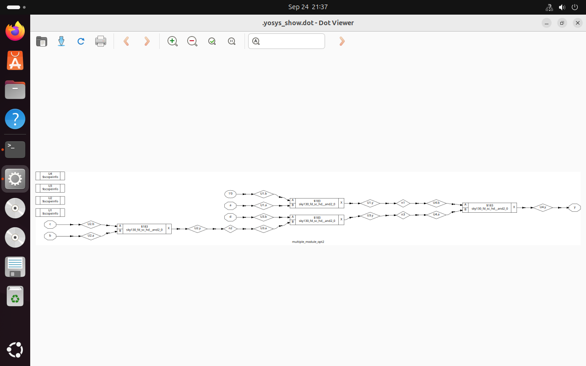
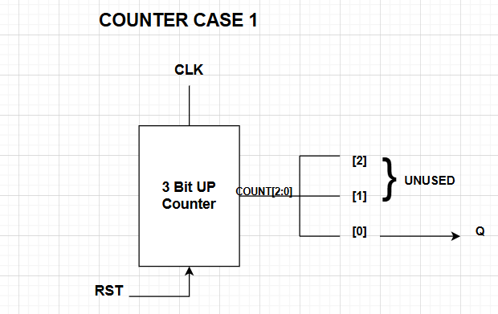

````markdown
---

# Day 3: Combinational and Sequential Optimization

## 📌 Introduction

In digital design, optimization is crucial for reducing **area, power, and delay** while maintaining correct functionality.  
This day focuses on:

* **Combinational Logic Optimization**
* **Sequential Logic Optimization**

Both are applied during **logic synthesis** using **Yosys** with the Sky130 standard cell library.  

**Goal of optimization:**  
* Minimize resource usage (gates, flip-flops)  
* Improve timing (reduce critical path)  
* Reduce power consumption  
* Maintain functional correctness

---

## 🔹 Combinational Logic Optimization

Combinational optimization aims to **reduce redundant logic** and simplify Boolean expressions for minimal hardware usage.

### ✨ Techniques Used:

* **Constant Propagation** → Replaces constant signals in expressions to simplify logic.
* **Boolean Logic Optimization** → Simplifies expressions using K-Map, Quine-McCluskey, or synthesis algorithms in Yosys.

### Why It Matters:

* Reduces **area** by minimizing gates  
* Reduces **delay** by eliminating unnecessary logic levels  
* Reduces **power** consumption by decreasing switching activity  

#### Example 1: Constant Propagation

📷 Example Output  


**Observation:** The constant logic is replaced, reducing gate count.  

#### Example 2: Boolean Logic Optimization

📷 Example Output  


**Observation:** Simplified Boolean expression leads to a smaller netlist and faster execution.

---

## 🔹 Sequential Logic Optimization

Sequential optimization improves **register usage, FSM designs, and pipelining**.  

### Types:

* **Basic** → Sequential constant propagation  
* **Advanced** → State optimization, retiming, sequential logic cloning  

### Benefits:

* Reduces flip-flop count  
* Improves performance by **minimizing critical path** through retiming  
* Reduces area and power  

---

## 🔹 Modules and Results

### 1️⃣ `opt_check.v`

```verilog
module opt_check (input a , input b , output y);
	assign y = a?b:0;
endmodule
````

**Objective:** Optimize simple conditional logic.

**Simulation Commands:**

```bash
iverilog opt_check.v tb_opt_check.v
./a.out
gtkwave tb_opt_check.vcd
```

📷 Simulation Output:


**Synthesis Commands:**

```tcl
yosys
read_liberty -lib ../VLSI/sky130RTLDesignAndSynthesisWorkshop/lib/sky130_fd_sc_hd__tt_025C_1v80.lib
read_verilog opt_check.v
synth -top opt_check
opt_clean -purge
abc -liberty ../VLSI/sky130RTLDesignAndSynthesisWorkshop/lib/sky130_fd_sc_hd__tt_025C_1v80.lib
show
```

📷 Synthesized Netlist:

*Observation: Synthesis produced a single AND gate, minimizing resources.*

---

### 2️⃣ `opt_check2.v`

```verilog
module opt_check2 (input a , input b , output y);
	assign y = a?1:b;
endmodule
```

**Observation:** Conditional assignment with constants triggers logic simplification.

**Synthesis Output:** OR gate


**Takeaway:** Constant propagation and Boolean optimization reduce combinational complexity.

---

### 3️⃣ `opt_check3.v`

```verilog
module opt_check3 (input a , input b, input c , output y);
	assign y = a?(c?b:0):0;
endmodule
```

**Observation:** Nested conditions are simplified.

**Synthesis Output:** Three-input AND gate


---

### 4️⃣ `opt_check4.v`

```verilog
module opt_check4 (input a , input b , input c , output y);
 assign y = a?(b?(a & c ):c):(!c);
endmodule
```

**Observation:** Complex conditional logic reduced to minimal gates.

**Synthesis Output:** Two-input XNOR gate


---

### 5️⃣ `multiple_module_opt1.v`

```verilog
module sub_module1(input a , input b , output y);
 assign y = a & b;
endmodule

module sub_module2(input a , input b , output y);
 assign y = a^b;
endmodule

module multiple_module_opt(input a , input b , input c , input d , output y);
wire n1,n2,n3;
sub_module1 U1 (.a(a) , .b(1'b1) , .y(n1));
sub_module2 U2 (.a(n1), .b(1'b0) , .y(n2));
sub_module2 U3 (.a(b), .b(d) , .y(n3));
assign y = c | (b & n1); 
endmodule
```

**Observation:** Hierarchical optimization reduces unnecessary intermediate gates.

📷 Netlist


---

### 6️⃣ `multiple_module_opt2.v`

```verilog
module sub_module(input a , input b , output y);
 assign y = a & b;
endmodule

module multiple_module_opt2(input a , input b , input c , input d , output y);
wire n1,n2,n3;
sub_module U1 (.a(a) , .b(1'b0) , .y(n1));
sub_module U2 (.a(b), .b(c) , .y(n2));
sub_module U3 (.a(n2), .b(d) , .y(n3));
sub_module U4 (.a(n3), .b(n1) , .y(y));
endmodule
```

📷 Netlist


**Takeaway:** Modular design helps in better synthesis and resource optimization.

---

## 🔹 Sequential Logic Optimization Examples

### DFF Const 1

```verilog
module dff_const1(input clk, input reset, output reg q);
always @(posedge clk, posedge reset)
begin
	if(reset)
		q <= 1'b0;
	else
		q <= 1'b1;
end
endmodule
```

**Observation:** Single flip-flop captures sequential behavior.

📷 Simulation & Synthesis:


*Design has 1 flip-flop*

---

### DFF Const 2

```verilog
module dff_const2(input clk, input reset, output reg q);
always @(posedge clk, posedge reset)
begin
	if(reset)
		q <= 1'b1;
	else
		q <= 1'b1;
end
endmodule
```

**Observation:** Q remains constant; no flip-flops required.

📷 Synthesis:


---

### DFF Const 3, 4, 5

*Modules demonstrate sequential logic propagation and optimization.*

📷 Simulation & Synthesis outputs included in images:

* DFF3: 
* DFF4: 
* DFF5: 

**Observation:** DFF5 uses 2 flip-flops due to sequential propagation; others optimized depending on constant behavior.

---

## 🔹 Counter Optimizations

### Counter Opt

```verilog
module counter_opt (input clk , input reset , output q);
reg [2:0] count;
assign q = count[0];

always @(posedge clk ,posedge reset)
begin
	if(reset)
		count <= 3'b000;
	else
		count <= count + 1;
end
endmodule
```

**Observation:** 3-bit up-counter; Yosys optimizes the number of flip-flops.

📷 Outputs:



**Takeaway:** Sequential optimization reduces resource usage while maintaining correct counting.

---


```

