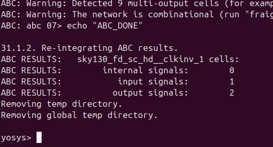

---

# Day 3: Combinational and Sequential Optimization

## 📌 Introduction

In digital design, optimization is crucial for reducing **area, power, and delay** while maintaining correct functionality.
This day focuses on:

* **Combinational Logic Optimization**
* **Sequential Logic Optimization**

Both are applied during **logic synthesis** using **Yosys** with the Sky130 standard cell library.

---

## 🔹 Combinational Logic Optimization

Combinational optimization tries to **squeeze the logic** for minimal resources.

### ✨ Techniques Used:

* **Constant Propagation** → Direct optimization by replacing constants.
* **Boolean Logic Optimization** → Techniques like K-Map simplification and Quine-McCluskey.

#### Example 1: Constant Propagation

📷 Example Output


#### Example 2: Boolean Logic Optimization

📷 Example Output


---

## 🔹 Sequential Logic Optimization

Sequential optimization improves registers and FSM designs.

### Types:

* **Basic** → Sequential constant propagation
* **Advanced** → State optimization, retiming, sequential logic cloning

📷 Example Outputs


---

## 🔹 Modules and Results

### 1️⃣ opt_check.v

```verilog
module opt_check (input a , input b , output y);
	assign y = a?b:0;
endmodule
```

**Aim:**


**Synthesis Commands:**

```tcl
yosys
read_liberty -lib ../VLSI/sky130RTLDesignAndSynthesisWorkshop/lib/sky130_fd_sc_hd__tt_025C_1v80.lib
read_verilog opt_check.v
synth -top opt_check
opt_clean -purge
abc -liberty ../VLSI/sky130RTLDesignAndSynthesisWorkshop/lib/sky130_fd_sc_hd__tt_025C_1v80.lib
show
```

📷 Synthesized Netlist


---

### 2️⃣ opt_check2.v

```verilog
module opt_check2 (input a , input b , output y);
	assign y = a?1:b;
endmodule
```

**Aim:**
📷 

**Synthesis Commands:** (same as above with `opt_check2.v`)

---

### 3️⃣ opt_check3.v

```verilog
module opt_check3 (input a , input b, input c , output y);
	assign y = a?(c?b:0):0;
endmodule
```

**Aim:**
📷 

---

### 4️⃣ opt_check4.v

```verilog
module opt_check4 (input a , input b , input c , output y);
 assign y = a?(b?(a & c ):c):(!c);
endmodule
```

**Aim:**
📷 

---

### 5️⃣ multiple_module_opt1.v

```verilog
module sub_module1(input a , input b , output y);
 assign y = a & b;
endmodule

module sub_module2(input a , input b , output y);
 assign y = a^b;
endmodule

module multiple_module_opt(input a , input b , input c , input d , output y);
wire n1,n2,n3;
sub_module1 U1 (.a(a) , .b(1'b1) , .y(n1));
sub_module2 U2 (.a(n1), .b(1'b0) , .y(n2));
sub_module2 U3 (.a(b), .b(d) , .y(n3));
assign y = c | (b & n1); 
endmodule
```

📷 Netlist


---

### 6️⃣ multiple_module_opt2.v

```verilog
module sub_module(input a , input b , output y);
 assign y = a & b;
endmodule

module multiple_module_opt2(input a , input b , input c , input d , output y);
wire n1,n2,n3;
sub_module U1 (.a(a) , .b(1'b0) , .y(n1));
sub_module U2 (.a(b), .b(c) , .y(n2));
sub_module U3 (.a(n2), .b(d) , .y(n3));
sub_module U4 (.a(n3), .b(n1) , .y(y));
endmodule
```

📷 Netlist


---

### 🔹 Sequential Logic Optimization Examples

#### DFF Const 1


#### DFF Const 2


#### DFF Const 3


#### DFF Const 4


#### DFF Const 5




---

### 🔹 Counter Optimizations

#### Counter Opt


#### Counter Opt2


---

## ✅ Summary

* **Combinational optimization** reduces redundant logic (constant propagation, Boolean reduction).
* **Sequential optimization** simplifies registers and FSMs.
* **Yosys + Sky130 library** used for synthesis.
* **GTKWave** used for simulation verification.

---

Would you like me to **add a “Folder Structure” section** at the top (showing `src/`, `tb/`, `images/`, `lib/`)? That makes your repo much more professional.

