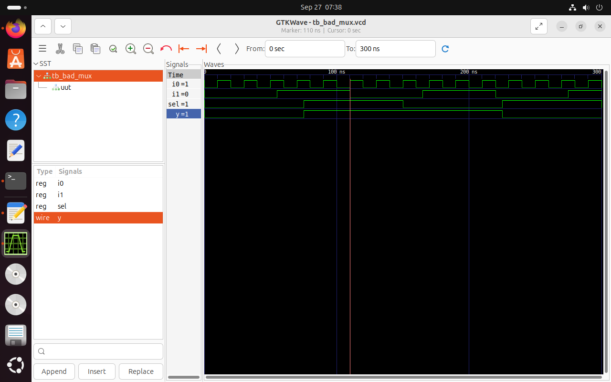
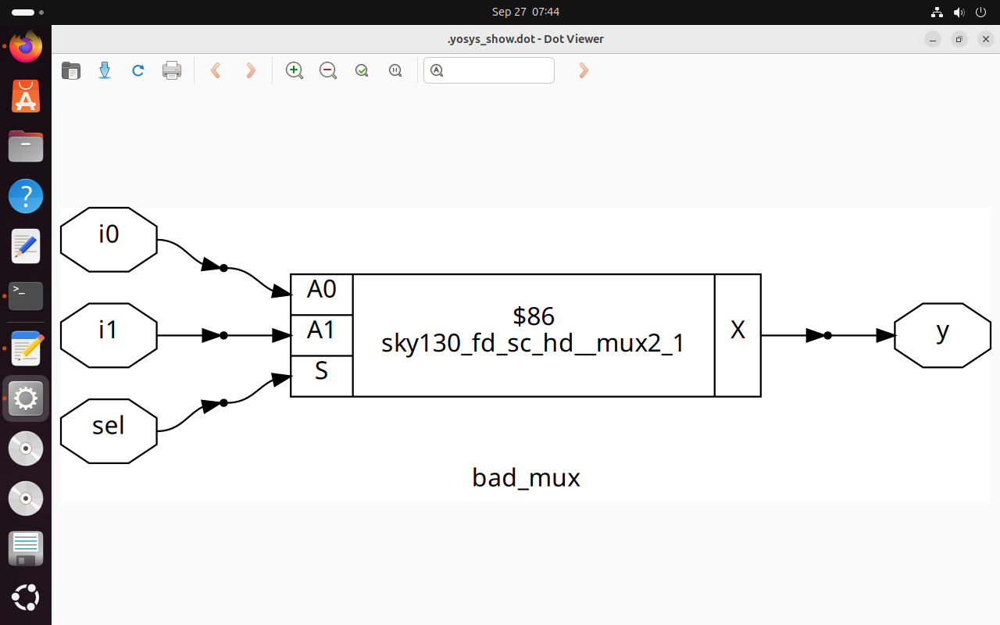
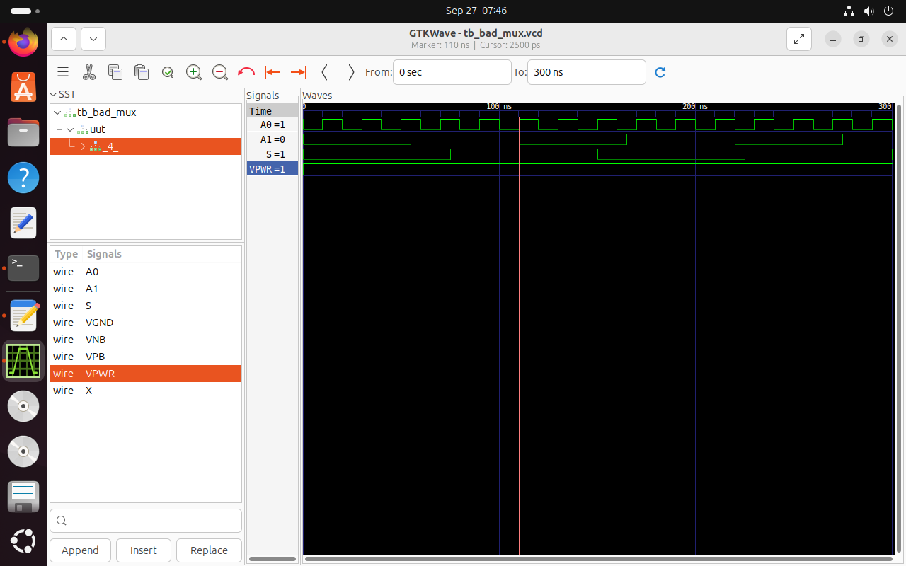
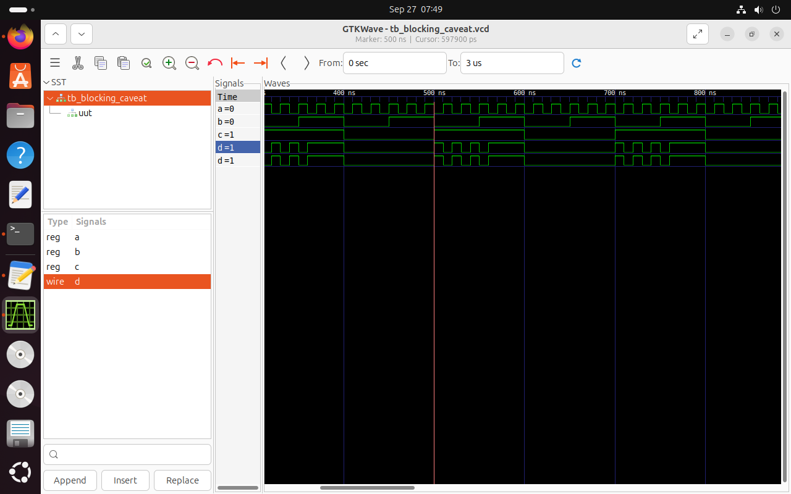
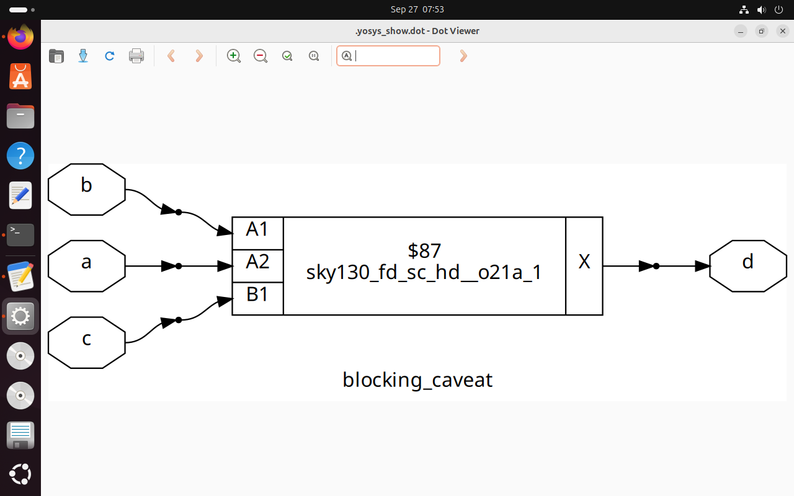
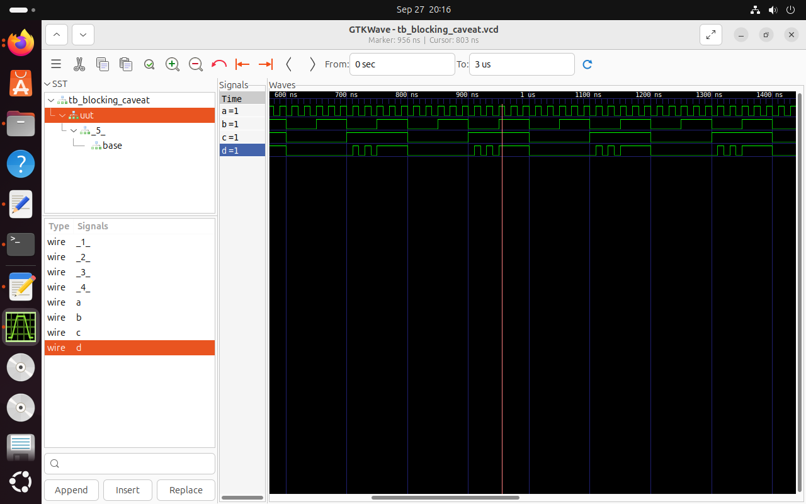

---

# Day 4: Gate Level Simulation (GLS), Blocking vs Non-Blocking, and Synthesis Mismatch

---

## 📌 Introduction

In digital design, after writing and verifying the RTL with **RTL simulations**, the next step is **synthesis**.
Synthesis generates a **netlist**, which is a gate-level representation of the design using the **standard cell library**.

To validate the correctness of this netlist, we use **Gate Level Simulation (GLS)**. Unlike RTL simulation, GLS runs the **same testbench** but with the **synthesized netlist as the DUT (Design Under Test)**.

---

## 🔹 Blocking vs Non-Blocking Assignments

### 🔸 Blocking Assignment (`=`)

* Executes **sequentially**, in the order written.
* Each assignment must finish before the next begins.
* Often used in **combinational logic**.

### 🔸 Non-Blocking Assignment (`<=`)

* Executes **in parallel**, with updates scheduled at the end of the simulation timestep.
* Typically used in **sequential logic** (e.g., inside clocked always blocks).

---

## 🔹 What is Gate Level Simulation (GLS)?

* GLS = **Simulation of the synthesized netlist** using the same testbench as RTL.
* Netlist functionality should be identical to RTL (if coded correctly).
* Unlike RTL simulation, GLS incorporates **cell delays** and verifies **timing correctness**.

---

## 🔹 Why Do We Need GLS?

1. ✅ To **verify logical correctness** of the design after synthesis.
2. ✅ To check that the **timing requirements are met**.
3. ✅ To identify **synthesis vs RTL mismatches**.
4. ✅ To validate the **functionality of the netlist**.
5. ✅ To debug issues related to **blocking vs non-blocking assignments**.

---

## 🔹 Delay Annotation in GLS

* GLS can be run in **two modes**:

  * **Functional Simulation** → Zero-delay (faster, checks only logic).
  * **Timing Simulation** → With delay annotation using **SDF (Standard Delay Format)** files.

* With delay annotation, GLS verifies **both logic and timing behavior**.

---

## 🔹 Why Verify Netlist Functionality?

* Ensures that the **synthesized netlist matches RTL behavior**.
* Synthesis tools may **optimize or transform logic**, which could introduce mismatches.

### ⚠️ Common Mismatch Example:

* RTL simulation works correctly.
* After synthesis, due to **blocking assignments** or **latch inference**, the **netlist behaves differently**.

---

## 🔹 Example: Synthesis-Simulation Mismatch

### Code (Ternary Operator MUX)

```verilog
module ternary_operator_mux (input i0, input i1, input sel, output y);
  assign y = sel ? i1 : i0;
endmodule
```

###   Simulation Commands

```bash
iverilog ternary_operator_mux.v tb_ternary_operator_mux.v
./a.out
gtkwave ternary_operator_mux.vcd
```


---

### Synthesis using Yosys

```bash
yosys
read_liberty -lib ../VLSI/sky130RTLDesignAndSynthesisWorkshop/lib/sky130_fd_sc_hd__tt_025C_1v80.lib
read_verilog ternary_operator_mux.v
synth -top ternary_operator_mux

abc -liberty ../VLSI/sky130RTLDesignAndSynthesisWorkshop/lib/sky130_fd_sc_hd__tt_025C_1v80.lib
write_verilog -noattr ternary_operator_net.v
show
exit
```


---

### ▶️ Gate Level Simulation (GLS) Commands

```bash
iverilog /home/harshini/VLSI/sky130RTLDesignAndSynthesisWorkshop/my_lib/verilog_model/primitives.v \
        /home/harshini/VLSI/sky130RTLDesignAndSynthesisWorkshop/my_lib/verilog_model/sky130_fd_sc_hd.v \
        ternary_operator_mux_net.v tb_ternary_operator_mux.v
./a.out
gtkwave tb_ternary_operator_mux.vcd
```


---
## 🔹 Example: Synthesis-Simulation Mismatch

### Code (BAD MUX)

```verilog

module bad_mux(input i0, input i1, input sel, output reg y);
always @ (sel)  # mistake 
begin
   if(sel)
       y = i1;
   else
       y = i0;
 end
endmodule  
  
```

###   Simulation Commands

```bash
iverilog ternary_operator_mux.v tb_ternary_operator_mux.v
./a.out
gtkwave ternary_operator_mux.vcd
```




---

### Synthesis using Yosys

```bash
yosys
read_liberty -lib ../VLSI/sky130RTLDesignAndSynthesisWorkshop/lib/sky130_fd_sc_hd__tt_025C_1v80.lib
read_verilog bad_mux.v
synth -top bad_mux

abc -liberty ../VLSI/sky130RTLDesignAndSynthesisWorkshop/lib/sky130_fd_sc_hd__tt_025C_1v80.lib
write_verilog -noattr bad_mux.v
show
exit
```




---

###  Gate Level Simulation (GLS) Commands

```bash
iverilog /home/harshini/VLSI/sky130RTLDesignAndSynthesisWorkshop/my_lib/verilog_model/primitives.v \
        /home/harshini/VLSI/sky130RTLDesignAndSynthesisWorkshop/my_lib/verilog_model/sky130_fd_sc_hd.v \
        bad_mux_net.v tb_bad_mux.v
./a.out
gtkwave tb_bad_mux.vcd
```


 **the testbench for rtl and netlist is not same in both case**

---

## 🔹 Example: Synthesis-Simulation Mismatch by Blocking statement:
### Code (BAD MUX)

```verilog

module blocking_caveat (input a , input b , input  c, output reg d); 
reg x;
always @ (*)
begin
	d = x & c; // this will mimic a delay or flop,if i synthesis there will be no flip flop
	x = a | b;
end
endmodule
  
  
```

###   Simulation Commands

```bash
iverilog blocking_caveat.v tb_blocking_caveat.v.v
./a.out
gtkwave ternary_operator_mux.vcd
```




---

### Synthesis using Yosys

```bash
yosys
read_liberty -lib ../VLSI/sky130RTLDesignAndSynthesisWorkshop/lib/sky130_fd_sc_hd__tt_025C_1v80.lib
read_verilog blocking_caveat.v
synth -top blocking_caveat

abc -liberty ../VLSI/sky130RTLDesignAndSynthesisWorkshop/lib/sky130_fd_sc_hd__tt_025C_1v80.lib
write_verilog -noattr blocking_caveat_net.v
show
exit
```




---

###  Gate Level Simulation (GLS) Commands

```bash
iverilog /home/harshini/VLSI/sky130RTLDesignAndSynthesisWorkshop/my_lib/verilog_model/primitives.v \
        /home/harshini/VLSI/sky130RTLDesignAndSynthesisWorkshop/my_lib/verilog_model/sky130_fd_sc_hd.v \
        blocking_caveat.v tb_blocking_caveat.v
./a.out
gtkwave tb_blocking_caveat.vcd
```

**the rtl testbench and netlist testbench was different because of the blocking statement assignment mistake**
