---

# Day 5: Optimization in Synthesis & IF/CASE Constructs

---

## 📌 Introduction

In digital design, **optimization during synthesis** ensures that the RTL is mapped efficiently to hardware while preserving intended functionality.
The way we write RTL using **IF and CASE constructs** has a major impact on the synthesized logic.

---

## 🔹 IF Constructs

### 1. **Priority Logic with IF**

* The `if` statement introduces **priority logic**.
* Example:

  ```verilog
  if (cond1)
      y = a;
  else if (cond2)
      y = b;
  else
      y = c;
  ```

  ➝ This means **cond1 has the highest priority**, then cond2, and finally default.

---

### 2. **Danger / Caution with IF**

* **Incomplete IF statements** can lead to **inferred latches**.
* Latches are not always desired and may cause **timing hazards**.

✅ Example of unintended latch:

```verilog
always @(*) begin
    if (en)
        q = d;    // Missing else → q holds previous value → latch inferred
end
```

---

### 3. **When Latches Are Intended**

* In some designs, like **counters with enable**, latches are intentionally created.
* Example:

```verilog
always @(posedge clk) begin
    if (en)
        count <= count + 1;  
    // if en is 0 → count holds previous value → latch-like behavior
end
```

---

## 🔹 CASE Constructs

### 1. **Usage**

* `case` statements are commonly used inside **always blocks** to select among multiple choices.

Example:

```verilog
always @(*) begin
    case(sel)
        2'b00: y = a;
        2'b01: y = b;
        2'b10: y = c;
        default: y = d;
    endcase
end
```

---

### 2. **Incomplete CASE Statements**

* Missing a **default case** can also create **inferred latches**.
* Good practice: Always include a `default` branch, even if unused.

✅ Example (safe coding style):

```verilog
case(sel)
    2'b00: y = a;
    2'b01: y = b;
    2'b10: y = c;
    default: y = d;   // prevents latch
endcase
```

---
## **Examples** 
### **incomplete if**
code:
```verilog
module incomp_if (input i0 , input i1 , input i2 , output reg y);
always @ (*)
begin
	if(i0)
		y <= i1;
end
endmodule
```
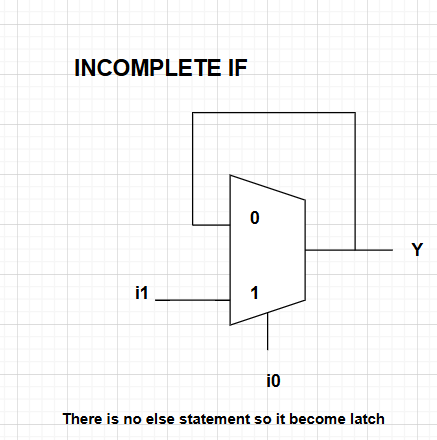

## **simulation:**
```
iverilog incomp_if.v tb_incomp_if.v
./a.out
gtkwave tb_incomp_if.vcd
```
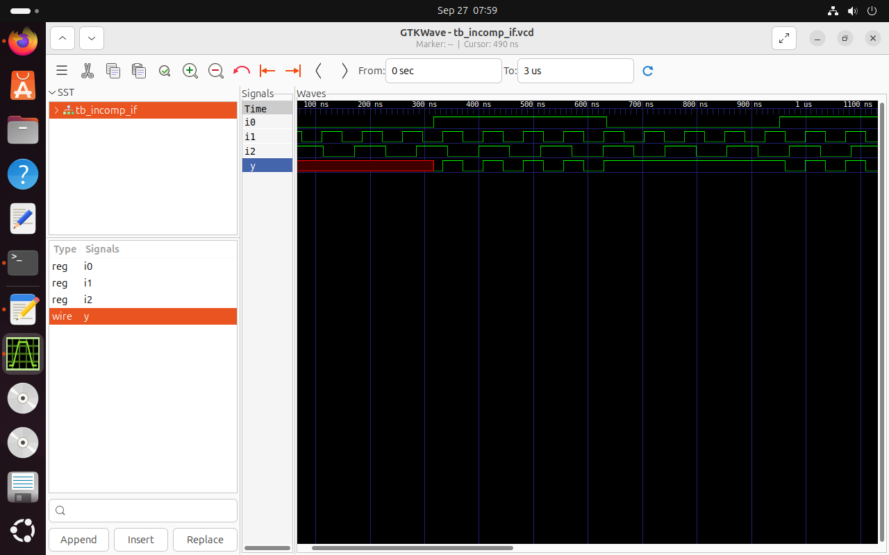

## **synthesis:**
```tcl
yosys
read_liberty -lib ../VLSI/sky130RTLDesignAndSynthesisWorkshop/lib/sky130_fd_sc_hd__tt_025C_1v80.lib
read_verilog incomp_if.v
synth -top incomp_if
abc -liberty ../VLSI/sky130RTLDesignAndSynthesisWorkshop/lib/sky130_fd_sc_hd__tt_025C_1v80.lib
show
```
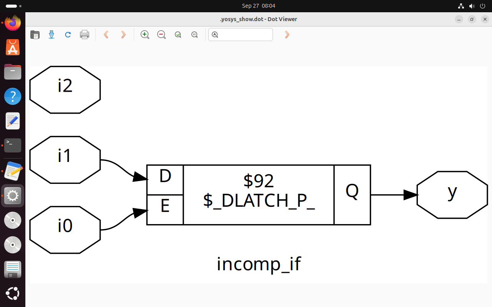


---
### **incomplete if2**
code:
```verilog
module incomp_if2 (input i0 , input i1 , input i2 , input i3, output reg y);
always @ (*)
begin
	if(i0)
		y <= i1;
	else if (i2)
		y <= i3;

end
endmodule
```
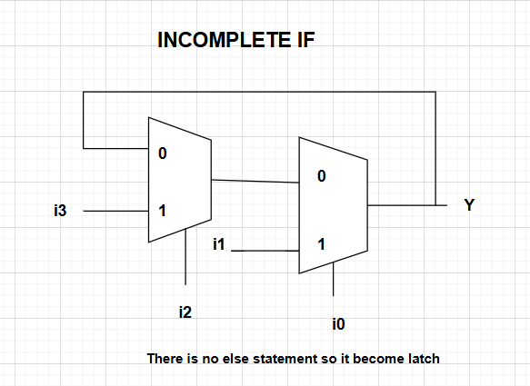

## **simulation:**
```
iverilog incomp_if2.v tb_incomp_if2.v
./a.out
gtkwave tb_incomp_if2.vcd
```
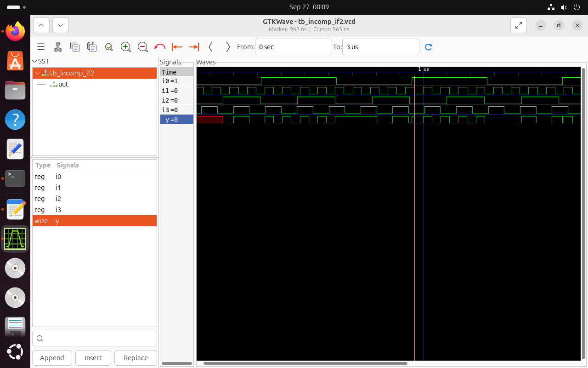

## **synthesis:**
```tcl
yosys
read_liberty -lib ../VLSI/sky130RTLDesignAndSynthesisWorkshop/lib/sky130_fd_sc_hd__tt_025C_1v80.lib
read_verilog incomp_if2.v
synth -top incomp_if2
abc -liberty ../VLSI/sky130RTLDesignAndSynthesisWorkshop/lib/sky130_fd_sc_hd__tt_025C_1v80.lib
show
```
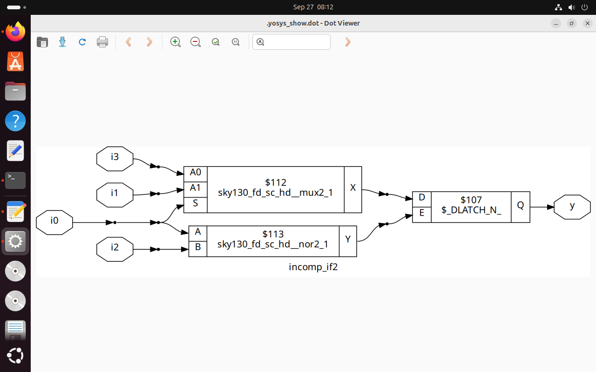

---
### **incomp_case**
code:
```verilog
module incomp_case (input i0 , input i1 , input i2 , input [1:0] sel, output reg y);
always @ (*)
begin
	case(sel)
		2'b00 : y = i0;
		2'b01 : y = i1;
	endcase
end
endmodule
```
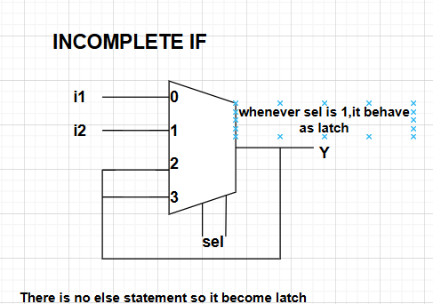

## **simulation:**
```
iverilog incomp_case.v tb_incomp_case.v
./a.out
gtkwave tb_incomp_if.vcd
```


## **synthesis:**
```tcl
yosys
read_liberty -lib ../VLSI/sky130RTLDesignAndSynthesisWorkshop/lib/sky130_fd_sc_hd__tt_025C_1v80.lib
read_verilog incomp_case.v
synth -top incomp_case
abc -liberty ../VLSI/sky130RTLDesignAndSynthesisWorkshop/lib/sky130_fd_sc_hd__tt_025C_1v80.lib
show
```
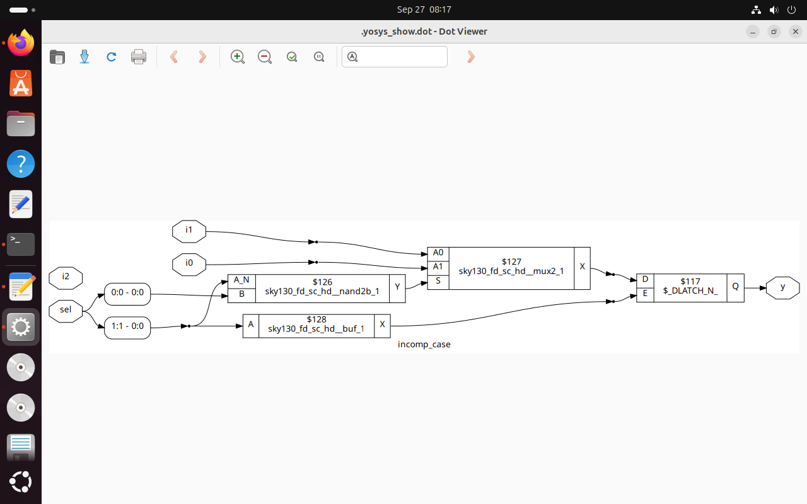


---

### **comp_case**
code:
```verilog
module comp_case (input i0 , input i1 , input i2 , input [1:0] sel, output reg y);
always @ (*)
begin
	case(sel)
		2'b00 : y = i0;
		2'b01 : y = i1;
		default : y = i2;
	endcase
end
endmodule
```
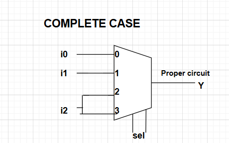

## **simulation:**
```
iverilog comp_case.v tb_comp_case.v
./a.out
gtkwave tb_comp_if.vcd
```
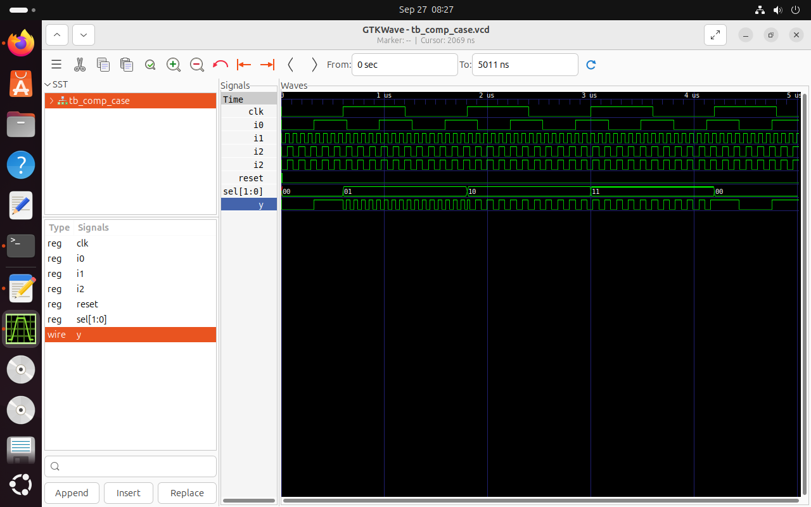

## **synthesis:**
```tcl
yosys
read_liberty -lib ../VLSI/sky130RTLDesignAndSynthesisWorkshop/lib/sky130_fd_sc_hd__tt_025C_1v80.lib
read_verilog comp_case.v
synth -top comp_case
abc -liberty ../VLSI/sky130RTLDesignAndSynthesisWorkshop/lib/sky130_fd_sc_hd__tt_025C_1v80.lib
show
```
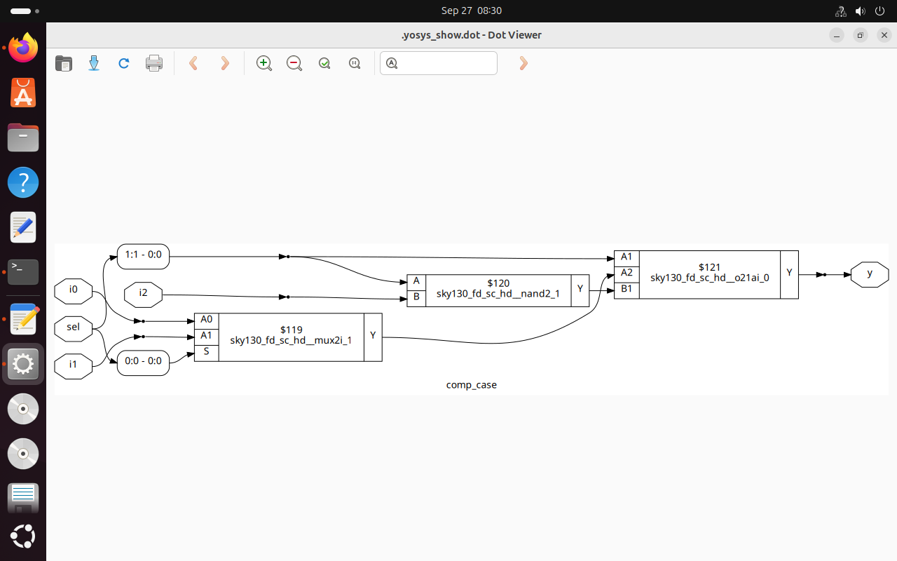


---

### **bad_case**
code:
```verilog
module bad_case (input i0 , input i1, input i2, input i3 , input [1:0] sel, output reg y);
always @(*)
begin
	case(sel)
		2'b00: y = i0;
		2'b01: y = i1;
		2'b10: y = i2;
		2'b1?: y = i3; //it cause confusion
		//2'b11: y = i3;
	endcase
end

endmodule
```


## **simulation:**
```
iverilog bad_case.v tb_bad_case.v
./a.out
gtkwave tb_bad_case.vcd
```
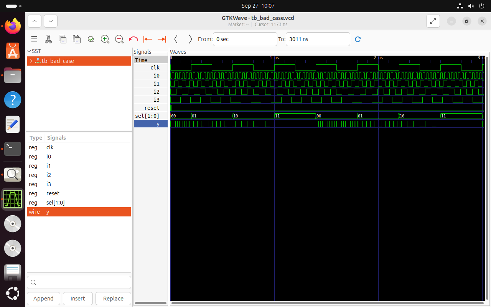

##  **synthesis:**
```tcl
yosys
read_liberty -lib ../VLSI/sky130RTLDesignAndSynthesisWorkshop/lib/sky130_fd_sc_hd__tt_025C_1v80.lib
read_verilog bad_case.v
synth -top bad_case
abc -liberty ../VLSI/sky130RTLDesignAndSynthesisWorkshop/lib/sky130_fd_sc_hd__tt_025C_1v80.lib
show
```
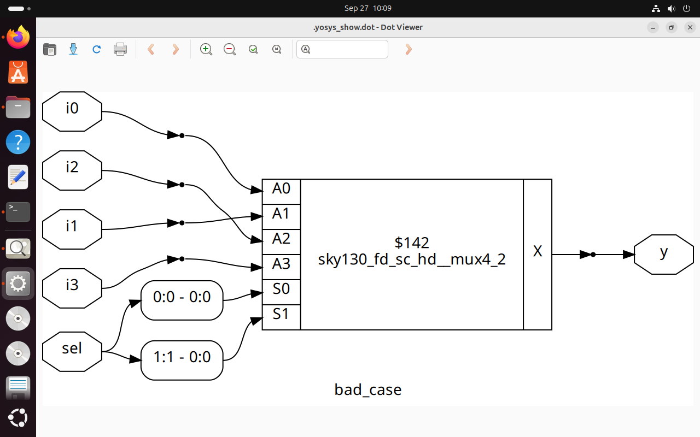
---
### **partial_case_assign**
code:
```verilog
module partial_case_assign (input i0 , input i1 , input i2 , input [1:0] sel, output reg y , output reg x);
always @ (*)
begin
	case(sel)
		2'b00 : begin
			y = i0;
			x = i2;
			end
		2'b01 : y = i1;
		default : begin
		           x = i1;
			   y = i2;
			  end
	endcase
end

```


## **simulation:**
```
iverilog partial_case_assign.v tb_partial_case_assign.v
./a.out
gtkwave tb_partial_case_assign.vcd
```
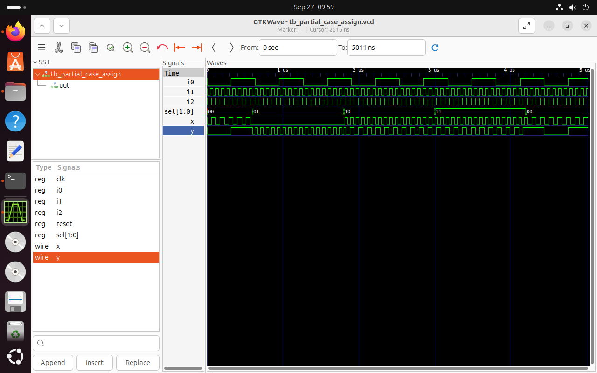

## **synthesis:**
```tcl
yosys
read_liberty -lib ../VLSI/sky130RTLDesignAndSynthesisWorkshop/lib/sky130_fd_sc_hd__tt_025C_1v80.lib
read_verilog partial_case_assign.v
synth -top partial_case_assign
abc -liberty ../VLSI/sky130RTLDesignAndSynthesisWorkshop/lib/sky130_fd_sc_hd__tt_025C_1v80.lib
show
```
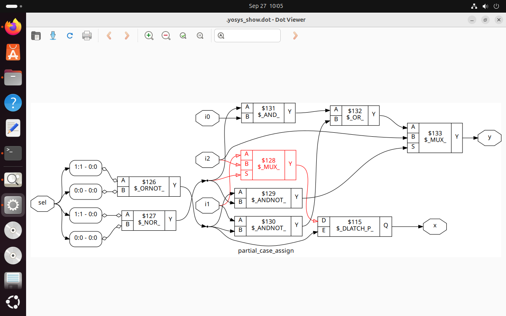


---
** FOR vs FOR-GENERATE Loops**
1. FOR Loop

Used inside always blocks.

Executes during simulation time, not instantiation.

2. FOR-GENERATE Loop

Used outside always blocks.

Instantiates multiple hardware blocks during synthesis/elaboration.

##Example
##MUX
code:
```
module mux_generate (input i0 , input i1, input i2 , input i3 , input [1:0] sel  , output reg y);
wire [3:0] i_int;
assign i_int = {i3,i2,i1,i0};
integer k;
always @ (*)
begin
for(k = 0; k < 4; k=k+1) begin
	if(k == sel)
		y = i_int[k];
end
end
endmodule
```
## **Simulation output:**
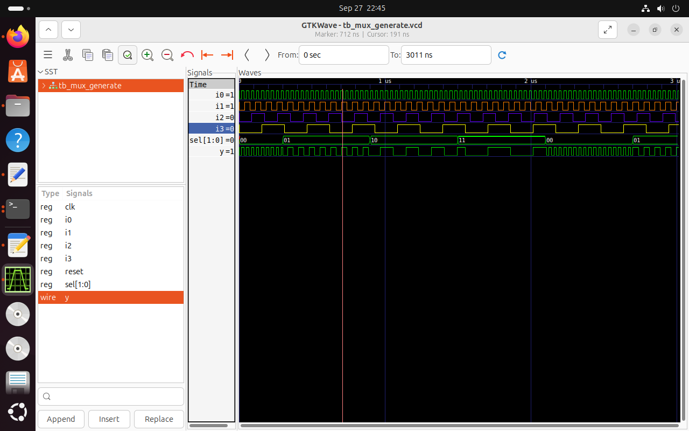
## **Synthesis output:**
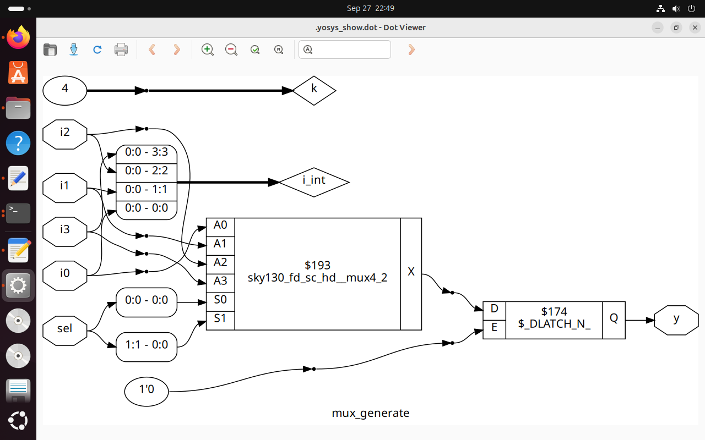
**It generate 4x1 MUX**
---
##DEMUX##
code:
```
module demux_case (output o0 , output o1, output o2 , output o3, output o4, output o5, output o6 , output o7 , input [2:0] sel  , input i);
reg [7:0]y_int;
assign {o7,o6,o5,o4,o3,o2,o1,o0} = y_int;
integer k;
always @ (*)
begin
y_int = 8'b0;
	case(sel)
		3'b000 : y_int[0] = i;
		3'b001 : y_int[1] = i;
		3'b010 : y_int[2] = i;
		3'b011 : y_int[3] = i;
		3'b100 : y_int[4] = i;
		3'b101 : y_int[5] = i;
		3'b110 : y_int[6] = i;
		3'b111 : y_int[7] = i;
	endcase

end
endmodule


```
## **Simulation output:**
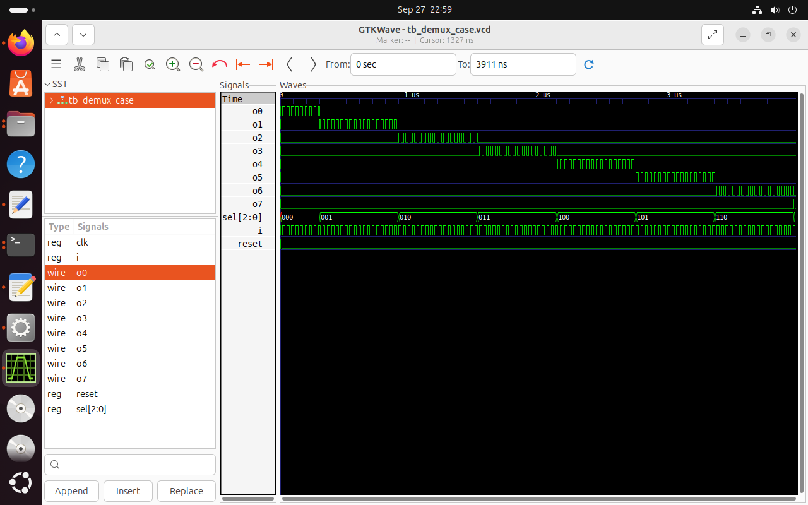
## **Synthesis output:**
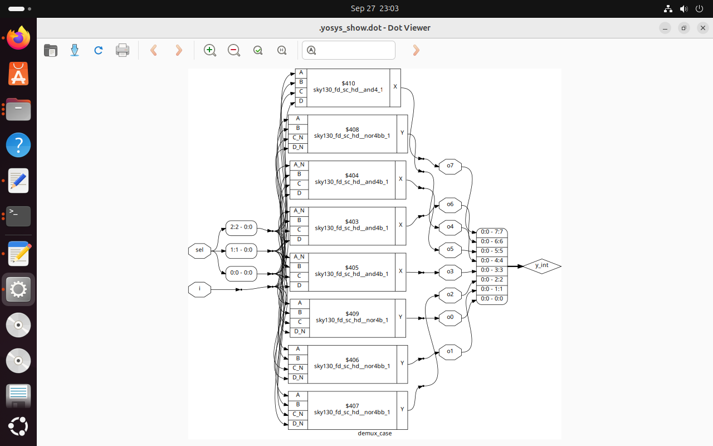
---
## **code:**
```
module demux_generate (output o0 , output o1, output o2 , output o3, output o4, output o5, output o6 , output o7 , input [2:0] sel  , input i);
reg [7:0]y_int;
assign {o7,o6,o5,o4,o3,o2,o1,o0} = y_int;
integer k;
always @ (*)
begin
y_int = 8'b0;
for(k = 0; k < 8; k++) begin
	if(k == sel)
		y_int[k] = i;
end
end
endmodule


```
## **Simulation output:**

## **Synthesis output:**
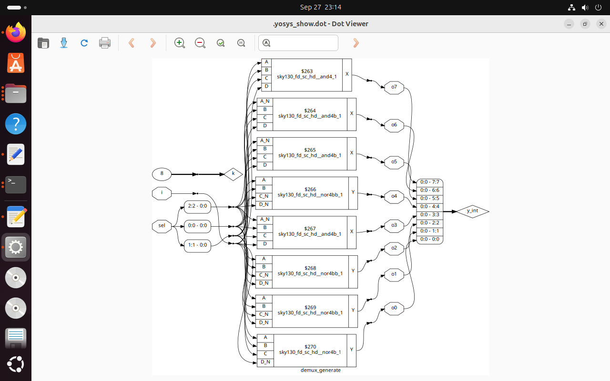
---


